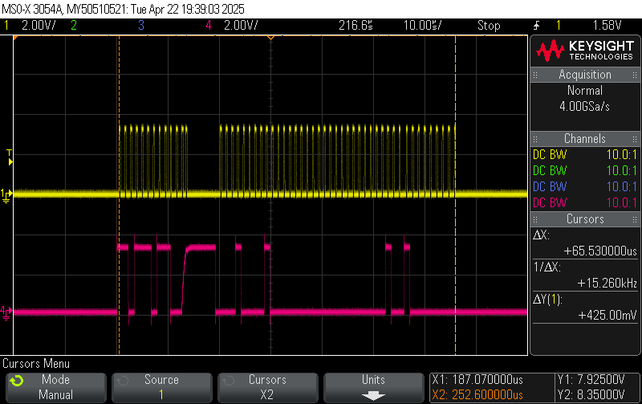
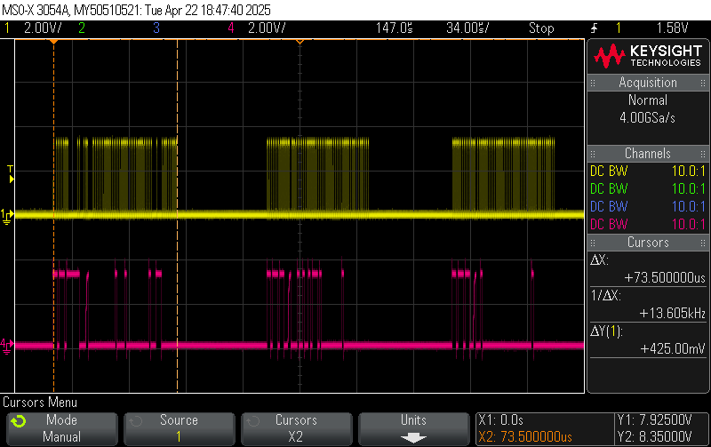

## remote_swd for OpenOCD

This is an ESP32 implementation of the new OpenOCD remote_swd protocol. It
allows an ESP32 to act as an SWD flash programmer for ARM microcontrollers.
OpenOCD can connect to this device using TCP/IP over WiFi. This allows remote
flashing and debugging of the ARM target.

The remote_swd driver is intended as a faster alternative to the OpenOCD
remote_bitbang driver. Whereas remote_bitbang sends a separate TCP/IP packet
for each transition of the SWDIO and SWCLK pins, remote_swd sends at most 1
packet for each 32-bit read or write. In many cases it can batch several writes
into a single TCP/IP packet, improving performance. The ESP32 then locally
bit-bangs the SWDIO and SWCLK pins to perform each SWD transfer.


- Tested with the ESP32-C6-MINI-1 module.
- Two GPIO pins are needed for SWDIO and SWCLK. 100K pullup resistor on SWDIO,
  100K pulldown on SWCLK.
- A separate GPIO can control an activity LED.
- As a point of reference, flashing a 48KB firmware image to STM32G071
  completes in <em>9.5 seconds</em>. (The same operation using OpenOCD
  remote_bitbang took about 20 minutes).

To configure your WiFi SSID and password, copy the
```wifi_password_example.h``` file to ```wifi_password.h``` and edit it
appropriately. For privacy, do not commit this file.

## Limitations

- There is no support for adjusting the SWCLK frequency. It was measured at
  about 900 KHz.
- There is no support for controlling the RESET line (which doesn't seem to be
  necessary in my case).

## OpenOCD implementation

Refer to the [OpenOCD remote_swd](https://github.com/bkuschak/openocd)
implementation at:
```git@github.com:bkuschak/openocd.git/src/jtag/drivers/remote_swd.c```

On the OpenOCD side, update the ```tcl/interface/remote_swd.cfg```
configuration file to point to the ESP32 network address:

```
adapter driver remote_swd
remote_swd host 192.168.2.144
remote_swd port 5253
reset_config none
```

To flash an STM32 for example, run the following command from your OpenOCD
build directory. Replace ```firmware.elf``` with the name of your ELF file, and
```stm32g0x.cfg``` with the appropriate file for your microcontroller.

```
./src/openocd --search tcl \
              -f tcl/interface/remote_swd.cfg \
              -f tcl/target/stm32g0x.cfg \
              -c "program firmware.elf verify reset exit"
```

## Building

The [Arduino-Timer library](https://github.com/contrem/arduino-timer) is
a required prerequisite. Use the Arduino library manager to install it first.
(Currently it is only used for monitoring the WiFi status and controlling the
LED).

This build was tested with Arduino IDE v1.8.13, using the following settings:

- Board: Adafruit Feather ESP32-C6
- CPU Frequency: 80 MHz (Wifi)
- Flash Frequency: 40 MHz
- Flash mode: QIO
- Partition scheme: Default 4MB with SPIFFS (1.2MB APP / 1.5MB SPIFFS)
- Core debug level: None
- Erase all flash before sketch upload: Enabled
- JTAG adapter: Integrated USB JTAG

Flash it onto the ESP32 using USB. This project doesn't currently support OTA
updates, but it wouldn't be hard to add this.

## Operation

The ESP32 prints status and error messages to the USB serial port during
operation. A message is printed whenever the OpenOCD client connects or
disconnects. Only one active connection is allowed.

```
ESP32 remote_swd booting (HW version 1.0, SW version 0x100) ...
Attempting to connect to SSID 'SomeWifiRouter'
....
Connected to WiFi:
SSID:        SomeWifiRouter
RSSI:        -51 dBm
IP Address:  192.168.2.144
remote_swd server listening on port 5253.

Client connected.
Client disconnected.
```

A single SWD 32-bit transfer completes in about 66 microseconds, with an SWCLK
clock rate of approximately 1 MHz. Yellow is SWCLK. Red is SWDIO.



A set of three back-to-back transfers complete in about 300 microseconds. The
following scope capture shows a bit better than 50% utilization of the SWD
link.


