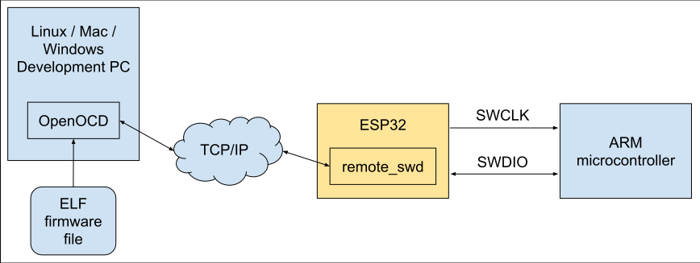

## OpenOCD remote_swd

This is an ESP32 implementation of the OpenOCD remote_swd protocol. It allows
an ESP32 to act as an SWD programmer for ARM microcontrollers. OpenOCD can
connect to this device over TCP/IP. This allows remote debugging / flashing of
the ARM target.

The remote_swd driver is intended as a faster alternative to the OpenOCD
remote_bitbang driver. Whereas remote_bitbang sends a separate TCP/IP packet
for each transition of the SWDIO and SWCLK pins, remote_swd sends at most 1
packet for each 32-bit read or write. In many cases it can batch several writes
into a single TCP/IP packet, improving performance.



- Tested with the ESP32-C6-MINI-1 module.
- Two GPIO pins are needed for SWDIO and SWCLK. A separate GPIO can control an
  activity LED.
- Flashing a 48KB firmware image to STM32G0x1 was completed in less than 10
  seconds. (The same operation using remote_bitbang took about 20 minutes).

To configure your WiFi SSID and password, copy the 
```wifi_password_example.h``` file to ```wifi_password.h``` and edit it
appropriately. For privacy, do not commit this file.

## OpenOCD implementation

Refer to the OpenOCD remote_swd implementation at:
```git@github.com:bkuschak/openocd.git/src/jtag/drivers/remote_swd.c```

On the OpenOCD side, update the remote_swd.cfg configuration file to point to
the ESP32 network address:

```
adapter driver remote_swd
remote_swd host 192.168.2.144
remote_swd port 5253
reset_config none
```

To flash an STM32, run the following command from your OpenOCD build directory.
Replace ```firmware.elf``` with the name of your ELF file, and
```std32g0x.cfg``` with the appropriate file for your microcontroller.

```
./src/openocd --search tcl \
              -f tcl/interface/remote_swd.cfg \
              -f tcl/target/stm32g0x.cfg \
              -c "program firmware.elf verify reset exit"
```

## Limitations

- Currently there is no support for adjusting the SWCLK frequency. It was
measured at about 800 KHz.
- Currently there is no support for controlling the RESET line (which doesn't
  seem to be necessary in my case).

